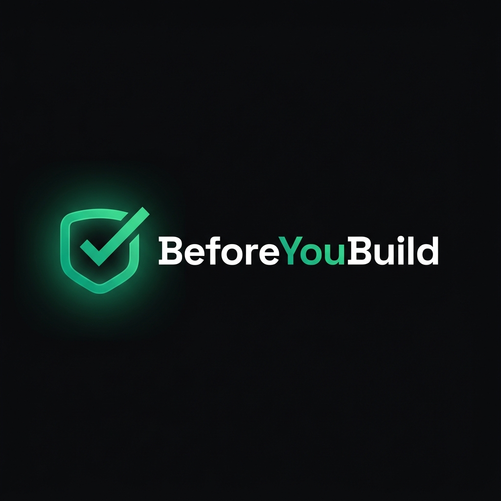

<div align="center">



<br/>

# BeforeYouBuild

### **Know if your startup idea is worth building. In 60 seconds.**

Stop wasting months on ideas nobody wants. Get an AI-powered market validation report — competitor analysis, market sizing, MVP roadmap — before you write a single line of code.

<br/>

[](https://react.dev)
[](https://typescriptlang.org)
[](https://anthropic.com)
[](https://supabase.com)
[](https://tailwindcss.com)
[](https://vitejs.dev)

<br/>

[🚀 **Live Demo**](#) · [📖 **Docs**](#setup) · [🐛 **Report Bug**](https://github.com/Suraj-kummar/BeforeYouBuild.com/issues) · [💡 **Request Feature**](https://github.com/Suraj-kummar/BeforeYouBuild.com/issues)

</div>

---

## 🎯 The Real Problem We're Solving

Every day, thousands of founders waste **months building products nobody wants**.

> A student in Pune spends 6 months building a food delivery app → launches → gets 0 users.
> Why? He never validated if the market actually wanted it.

**BeforeYouBuild fixes this.** Type your idea, get a full market research report in 60 seconds — before writing a single line of code.

### Who uses this?
| 🎓 College Students | 🚀 First-time Founders | 💼 Freelancers & SaaS Builders |
|---|---|---|
| Have a startup idea but don't know if it's worth building before dropping semesters on it | Before pitching to investors, validate your assumptions with real market data | Unsure about competition? Get clarity on your niche instantly |

---

## ✨ Features

### 🤖 AI-Powered Market Validation
- Uses **Claude Sonnet 4** with live **web search** to research your idea in real time
- Returns a brutally honest, structured report — not generic fluff

### 📊 Full Validation Report (10 Sections)
| Section | What You Get |
|---------|-------------|
| 🔥 **Verdict** | HOT / CAUTION / DEAD — one sharp sentence why |
| 📈 **Scores** | Market Size, Competition, Timing, Buildability (each /10) |
| 🎯 **The Problem** | Who feels it daily, with a named persona |
| 👤 **Ideal Customer** | ICP profile, where they hang out, what they currently use |
| 💰 **Market Size** | TAM / SAM / SOM with India-first context |
| ⚔️ **Competitors** | Top 3 with weaknesses and threat levels |
| 🛠️ **MVP Blueprint** | 3 core features + tools + build time |
| 🚀 **First 100 Users** | Exact steps, India-relevant channels |
| 🏁 **Final Verdict** | GO ✅ or NO-GO ❌ with 3 bullet reasons |
| 🔗 **Share Report** | Shareable link with "Validated by BeforeYouBuild" badge |

### 💳 Pricing Tiers
| Free | Pro — ₹499/mo | Startup — ₹1,499/mo |
|------|--------------|---------------------|
| 2 validations/month | Unlimited validations | Everything in Pro |
| Full AI report | PDF export | 5-seat team access |
| Web view | Saved history | API access |
| — | Priority AI model | Priority support (2h SLA) |

### 🔐 Authentication
- **Google OAuth** via Supabase
- **Magic Link** email login (no password needed)

---            

## 🛠️ Tech Stack

```
Frontend     →  React 19 + TanStack Router + TanStack Start
Styling      →  Tailwind CSS v4 + Custom Design System (OKLCH dark theme)
UI           →  shadcn/ui (Radix UI primitives)
AI Engine    →  Claude claude-sonnet-4-20250514 + Web Search Tool
Auth + DB    →  Supabase (Google OAuth + Magic Link)
Build        →  Vite 7 + Bun
Deploy       →  Cloudflare Workers (via Wrangler)
Typography   →  Space Grotesk (headings) + Inter (body)
```

---

## 🚀 Quick Start

### Prerequisites
- [Bun](https://bun.sh) installed (`curl -fsSL https://bun.sh/install | bash`)
- A [Supabase](https://supabase.com) project
- An [Anthropic](https://console.anthropic.com) API key

### 1. Clone the repo
```bash
git clone https://github.com/Suraj-kummar/BeforeYouBuild.com.git
cd BeforeYouBuild.com/idea-spark
```

### 2. Install dependencies
```bash
bun install
```

### 3. Set up environment variables
```bash
cp .env.example .env.local
```

Edit `.env.local`:
```env
# Supabase — from supabase.com → Project Settings → API
VITE_SUPABASE_URL=https://your-project.supabase.co
VITE_SUPABASE_ANON_KEY=your-anon-key-here

# Anthropic — from console.anthropic.com
ANTHROPIC_API_KEY=sk-ant-your-key-here
```          

### 4. Run locally
```bash
bun run dev
```

Open [http://localhost:8080](http://localhost:8080) 🎉

---

## 📁 Project Structure

```
idea-spark/
├── public/
│   ├── logo.png              # Full wordmark logo
│   └── logo-icon.png         # Icon (favicon)
├── src/
│   ├── components/
│   │   ├── SiteNav.tsx       # Sticky navbar with mobile menu
│   │   └── SiteFooter.tsx    # Footer with links + social
│   ├── lib/
│   │   ├── supabase.ts       # Supabase client + auth helpers
│   │   └── validate.ts       # Claude API server function
│   ├── routes/
│   │   ├── index.tsx         # Landing page (hero, samples, CTA)
│   │   ├── app.tsx           # Idea input + loading flow
│   │   ├── report.tsx        # Full validation report (10 sections)
│   │   ├── pricing.tsx       # Pricing tiers + comparison table
│   │   └── login.tsx         # Google + magic link auth
│   └── styles.css            # Design system (dark theme, animations)
├── .env.example              # Environment variable template
└── vite.config.ts            # Vite + TanStack Router config
```

---

## 🎨 Design System

Built on a **premium dark-first design** system:

```css
Background:   #0A0A0A  (near black)
Surface:      #111111  (card backgrounds)
Primary:      #10B981  (emerald green)
Accent Glow:  #34D399  (lighter emerald)
Text:         #FAFAFA  (near white)
Muted:        #737373  (secondary text)
```

**Animations included:**
- `animate-fade-up` — section entrances
- `animate-scale-in` — modal/card pop-ins
- `text-shimmer` — animated gradient headline text
- `animate-pulse-glow` — logo breathing effect
- `shadow-glow` — emerald glow shadows

---

## 🔌 Claude API Integration

The app uses Claude with **live web search** for real-time market research:

```typescript
// src/lib/validate.ts
export const validateIdea = createServerFn({ method: "POST" })
  .inputValidator((data: { idea: string }) => data)
  .handler(async ({ data }) => {
    const response = await fetch("https://api.anthropic.com/v1/messages", {
      headers: {
        "anthropic-beta": "web-search-2025-03-05",  // 🔍 Live web search
      },
      body: JSON.stringify({
        model: "claude-sonnet-4-20250514",
        tools: [{ type: "web_search_20250305", max_uses: 5 }],
        // Returns structured JSON with all 10 report sections
      }),
    });
  });
```

**System Prompt:** YC-trained startup analyst persona — brutally honest, India-aware, returns strict JSON.

---

## 📦 Download as Parts

The full project is also available as **20 split archives** (for easy sharing):

```
idea-spark-parts/
├── BeforeYouBuild.part01.bin  (~47 KB)
├── BeforeYouBuild.part02.bin
├── ...
└── BeforeYouBuild.part20.bin
```

**Reassemble on Mac/Linux:**
```bash
cat BeforeYouBuild.part*.bin > full.zip && unzip full.zip
```

**Reassemble on Windows (PowerShell):**
```powershell
$parts = Get-ChildItem "BeforeYouBuild.part*.bin" | Sort-Object Name
$out = [IO.File]::Create("full.zip")
foreach ($p in $parts) { $b = [IO.File]::ReadAllBytes($p.FullName); $out.Write($b,0,$b.Length) }
$out.Close(); Expand-Archive full.zip .
```

---

## 🗺️ Roadmap

- [x] Landing page with sample reports
- [x] AI validation with Claude + web search
- [x] Full 10-section report
- [x] Supabase Google + magic link auth
- [x] Pricing page (Free / Pro / Startup)
- [x] Premium dark design system
- [x] Logo + favicon
- [ ] Stripe payments integration
- [ ] PDF export for Pro users
- [ ] Saved report history
- [ ] Team collaboration (Startup tier)
- [ ] API access for developers
- [ ] Mobile app (React Native)

---

## 🤝 Contributing

Contributions are welcome! Please:

1. Fork the repo
2. Create a feature branch (`git checkout -b feat/amazing-feature`)
3. Commit your changes (`git commit -m 'feat: add amazing feature'`)
4. Push to the branch (`git push origin feat/amazing-feature`)
5. Open a Pull Request

---

## 📄 License

MIT License — see [LICENSE](LICENSE) for details.

---

## 👤 Author

**Suraj Kumar**

Built by a student, priced for founders. 🇮🇳

[](https://github.com/Suraj-kummar)

---

<div align="center">

**If this helped you validate a real idea, give it a ⭐**

*Stop building. Start validating.*

</div>
